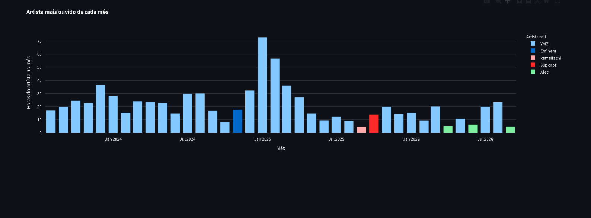

# 🎵 Spotify Personal Analytics

> Um pipeline pessoal, 100% offline, que processa o histórico completo de streaming do Spotify (Extended Streaming History) e transforma os dados brutos em análises visuais sobre hábitos de escuta.

---

## 📌 Sobre o Projeto

Em vez de depender do resumo anual do *Spotify Wrapped* ou de requisições contínuas à API oficial (com risco de *rate limit*), este projeto consome diretamente o arquivo de **Extended Streaming History**, exportado pelo próprio usuário através da página de privacidade do Spotify.

O objetivo é extrair, tratar e visualizar o histórico de reprodução para responder perguntas como: quanto tempo eu realmente escuto música por ano/mês? Quais artistas e faixas dominam minha rotina? Em que horários e dias eu mais escuto?

---

## 🚀 Funcionalidades Implementadas

- 📂 **Extração automatizada:** leitura e unificação de todos os arquivos `Streaming_History_Audio_*.json` do export, mesmo quando divididos em múltiplos arquivos.
- 🧹 **Tratamento de dados (ETL):** conversão de timestamps, cálculo de minutos efetivos de escuta (a partir de `ms_played`), remoção de registros sem faixa associada (ex: podcasts) e geração de colunas auxiliares de tempo (ano, mês, dia da semana, hora).
- 📊 **Visualização:** gráfico de pizza interativo (Plotly) mostrando a distribuição de minutos escutados por ano.
- 💾 **Exportação:** geração de um CSV tratado (`spotify_tratado.csv`), pronto para ser consumido em ferramentas de BI como Power BI.
- 🕒 **Ajuste de fuso horário:** conversão dos timestamps de UTC para `America/Sao_Paulo`, para que as análises por hora e dia da semana reflitam o horário real de escuta.
- 🏆 **Top artistas e faixas:** gráficos de barras com os 15 artistas e as 15 faixas mais escutados (em horas/minutos).
- ⏭️ **Análise de skip rate:** identificação dos artistas mais pulados, combinando os campos `skipped` e `reason_end`, com mínimo de 50 plays para evitar distorções.
- - 🗄️ **Persistência em SQLite:** armazenamento do histórico tratado em `spotify.db` (tabela `streams`) e de um resumo por artista (tabela `resumo_artistas`), pronto para consultas SQL.
  - - 🕐 **Escuta por hora e dia da semana:** gráficos de barras mostrando em quais horas do dia e em quais dias da semana você mais escuta música (já no fuso `America/Sao_Paulo`).
- 🗄️ **Persistência em SQLite:** histórico tratado em `spotify.db` (tabelas `streams` e `resumo_artistas`) para consultas em SQL.
- 🖥️ **Dashboard interativo (Streamlit):** filtros por ano, rankings configuráveis e abas com visão geral, artistas/faixas e hábitos de escuta.
- 🔎 **Análises em SQL:** perguntas respondidas com CTEs e funções de janela (`LAG`, `RANK`), documentadas em [analise.md](analise.md).
---

## 🛠️ Tecnologias Utilizadas

- **Linguagem:** Python 3
- **Processamento de dados:** Pandas
- **Visualização:** Plotly Express
- **Ambiente de desenvolvimento:** Google Colab
- - **Banco de dados:** SQLite
- - **Banco de dados:** SQLite
- **Dashboard:** Streamlit

---

## 🔧 Estrutura do Pipeline

1. **Upload e extração** do arquivo `.zip` do Extended Streaming History diretamente no Colab.
2. **Leitura** de todos os arquivos JSON (`Streaming_History_Audio_*.json`) e unificação em um único DataFrame.
3. **Tratamento:**
   - Conversão de `ts` para datetime, com fuso `America/Sao_Paulo`
   - Conversão de `ms_played` para minutos
   - Seleção das colunas relevantes (faixa, artista, álbum, tempo de escuta, motivo de término, se foi pulada, se estava em shuffle)
   - Remoção de registros inválidos
   - Criação de colunas de ano, mês, dia da semana e hora
   - Criação da coluna `pulada` (combinando `skipped` e `reason_end == 'fwdbtn'`)
4. **Visualização** dos minutos escutados por ano em gráfico de pizza.
5. **Análises:** top artistas, top faixas e skip rate por artista.
6. **Persistência** em banco SQLite (`spotify.db`) com a tabela completa e um resumo agregado por artista.
7. **Exportação** para CSV, com encoding compatível (`utf-8-sig`) para uso direto no Power BI ou Excel.

---

## 📥 Como Obter os Dados

1. Acesse [spotify.com/account/privacy](https://www.spotify.com/account/privacy/).
2. Na seção "Download dos seus dados", solicite o **Histórico de reprodução estendido** (Extended Streaming History).
3. Aguarde o e-mail do Spotify com o arquivo compactado (pode levar até 30 dias).

---

## 📸 Prévia

## 📊 O que os dados mostraram

- **47,4%** dos plays duram menos de 30 s, mas representam só **3%** das horas escutadas.
- Só **33,9%** das faixas são ouvidas até o fim.
- O artista mais ouvido concentra **17,4%** das 4.408,9 horas e foi o nº 1 em **32 dos 38 meses**.

Detalhes, consultas e conclusões em [analise.md](analise.md).

## 💻 Como Executar

1. Abra o notebook no Google Colab.
2. Rode a célula de upload e selecione o `.zip` recebido do Spotify.
3. Execute as células em sequência (extração → tratamento → visualização → exportação).
4. 4. Os arquivos `spotify_tratado.csv` e `spotify.db` ficam disponíveis para uso em outras ferramentas.
### Dashboard local
1. Gere o `spotify.db` rodando o notebook e coloque-o em `data/`.
2. `pip install -r requirements.txt`
3. `python -m streamlit run app.py`

---

## 🔭 Próximos Passos

- [x] Gráficos de top artistas e top faixas
- [x] Análise de taxa de músicas puladas (*skip rate*)
- [x] Heatmap de horários/dias de maior consumo
- [x] Persistência em banco SQLite para consultas SQL
- [x] Dashboard interativo com Streamlit
- [ ] Exportações adicionais agregadas (por mês, por artista) para uso em Power BI

---

## ⚠️ Nota sobre Privacidade

Este projeto é de uso estritamente pessoal, acadêmico e de portfólio. Todo o processamento é feito localmente/offline a partir de um arquivo exportado pelo próprio usuário, sem qualquer chamada à API do Spotify — em total conformidade com as diretrizes de uso de dados da plataforma.
